# SiGameIRL
Устройство для проведения "Своей игры" (SIGame) через "SImulator".

Автор программы для ПК Владимир Хиль: https://vladimirkhil.com/si

Это версия 0.1. К сборке __НЕ рекомендуется__. Скоро займусь версией 0.2, где будут учтены проблемы данной версии. В данный момент нажатия кнопок считываются в цикле и бывают моменты, когда два игрока одновременно нажимают кнопки (период между считываниями кнопок 50-100 микросекунд), в видео тестирования в описании можно найти такой момент. 

Вторая версия будет основана на базе STM32F103C8T6 Blue Pill. Все кнопки будут иметь собственное прерывание (мгновенное отрабатывание).

Тестирование платы:
* https://www.youtube.com/watch?v=pi8g3aP3nV4

SiGameIRL собранный (тестирование в игре с 5-ю участниками; там маты, так что 16+):
* https://www.youtube.com/watch?v=th2ahZnA1qU

# Что вам потребуется

## Ведущий

### Для использования с питанием от ПК или блока питания

* Arduino nano (не запаянная)
<dl></dl>

* Max7219 7-сегментный дисплей
<dl></dl>

* WS2812B светодиодная лента (60 светодиодов/м, 10 светодиодов с длинной 16.7см, можно также использовать и другую плотность светодиодов, общей длинной 16.7см)
<dl>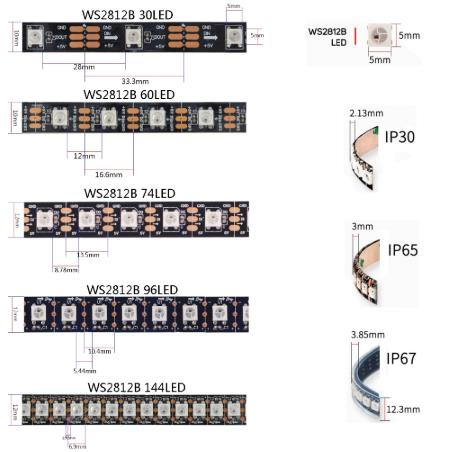</dl>

* Кнопки 6x6мм с длинным штоком (3 шт)
<dl>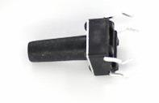</dl>

* Резисторы 100-1000 Ом (3 шт)

* Светодиоды (3 шт; желательно красный-желтый-зеленый)

* Макетная плата (для пайки кнопок ведущего и соединителей игроков) 

* Болты м3 (4 шт 6-12мм)

### Для автономного питания от аккумуляторов 18650

* TP4056 с защитой
<dl>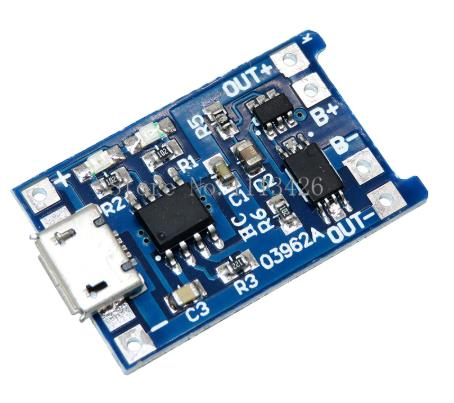</dl>

* 18650 держатель (1-2 шт; запаиваются ПАРАЛЛЕЛЬНО)
<dl>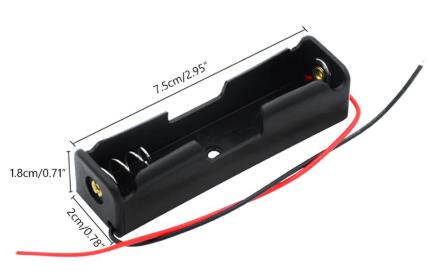</dl>

* Выключатель (10x15мм)
<dl>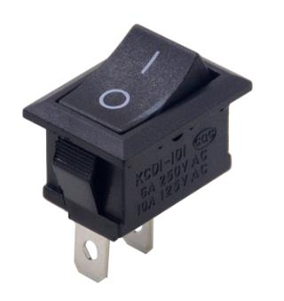</dl>

* Болты м3 (2 шт 6-20мм)

## Игрок (Умножаем на количество игроков, x8 обычно, но использовать можно и меньше)

* Кнопка 12x12mm
<dl></dl>

* Резистор 100-1000 Ом

* Светодиоды (3 шт, можно и 1-2шт; цвет не важен; запаиваются параллельно)

* JST 3 pin
<dl>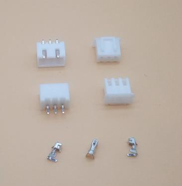</dl>

* BLS 3 pin

* PLS 3 pin

# Собранный вид

* Собранный вариант (без питания от аккумуляторов)
<dl>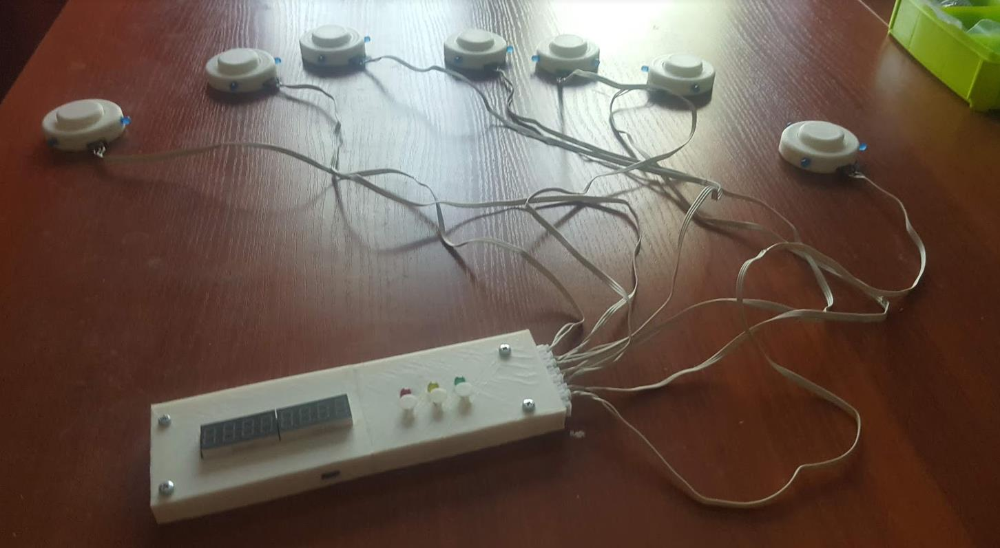</dl>
<dl>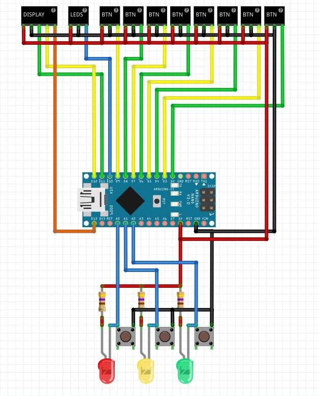</dl>

* Кнопка игрока
<dl>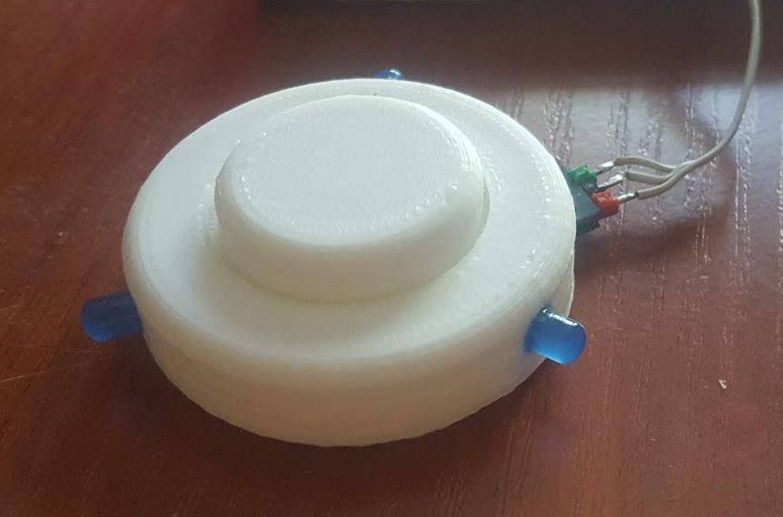</dl>
<dl>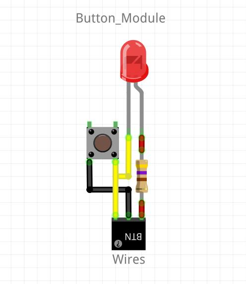</dl>

* Внутри
<dl></dl>

* Соединители игроков
<dl>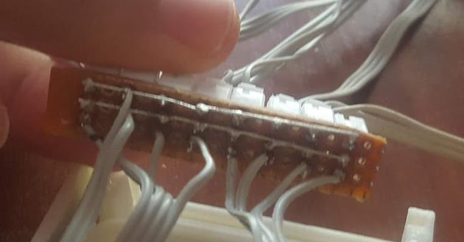</dl>

* Кнопки ведущего
<dl>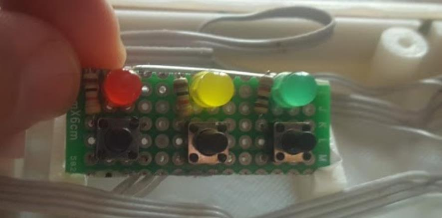</dl>

Все кнопки (сейчас) работают по следующей схеме: 
<dl></dl>
