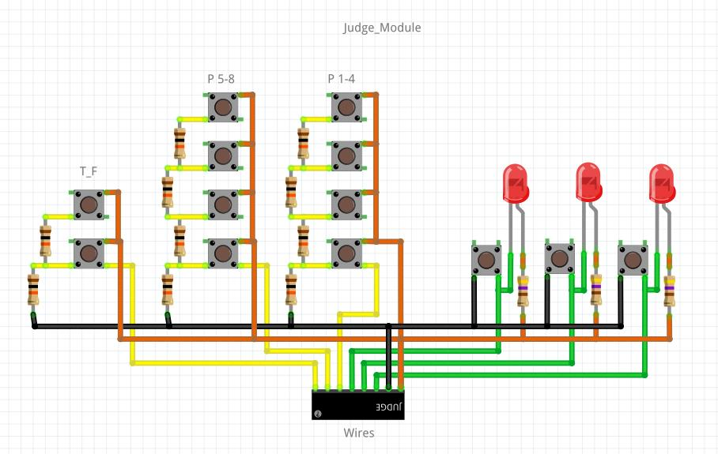

# SiGameIRL v0.2
Устройство для проведения "Своей игры" (SIGame) через "SImulator".

Автор программы для ПК Владимир Хиль: https://vladimirkhil.com/si

Это версия 0.2

Тестирование платы:
* https://www.youtube.com/watch?v=EU762Oh5ceg

Игровое тестирование подъедет как только мы проведем игру (при тестировании первой версии была шутка про подгон второй версии через 5 лет)... 

# Что вам потребуется

## Ведущий

* STM32F103C8T6 "Blue pill" (не запаянная) + программатор STLink v2 (желательно для прошивки, работа с другими методами прошивки не гарантируются)
<dl></dl>

* Arduino nano (не запаянная)
<dl></dl>

* Переключатель (опционально; 2 шт, либо 1 шт двухканальный, для разрыва цепи UART для программирования Arduino)

* Max7219 7-сегментный дисплей
<dl></dl>

* WS2812B светодиодная лента (60 светодиодов/м, 14 светодиодов с длинной 23.4см, можно также использовать и другую плотность светодиодов, общей длинной 23.4см, количество должно быть четным)
<dl></dl>

* Кнопки 12х12мм с крышкой (13 шт)
<dl></dl>

* Фоторезистор
<dl></dl>

* Резистор 10000 Ом (11 шт)

* JST 3 pin (8 шт)
<dl></dl>

* Макетная плата (для пайки соединителей игроков) 

* Болты м3 (4 шт 6-12мм)

* Конденсатор электролитический (опционально, для впайки по питанию между +5в и землей)

## Игрок (Умножаем на количество игроков, x8 обычно, но использовать можно и меньше)

* Кнопка 12x12мм (такие же как у судьи, но без крышек)
<dl></dl>

* Резистор 300-1000 Ом

* Светодиоды (3 шт, можно и 1-2шт; цвет не важен; запаиваются параллельно)

* BLS 3 pin

* PLS 3 pin

# Собранный вид

* Собранный вариант (без питания от аккумуляторов)
<dl></dl>
<dl></dl>
<dl></dl>

* Кнопка игрока
<dl></dl>
<dl></dl>

* Внутри
<dl></dl>
<dl></dl>
<dl></dl>

# Инструкция по использованию

## Первоначальная настройка

Как только вы подсоединяете питание, проходит проверка соединений (загораются кнопки, дисплей и индикатор). Затем вы переходите в первоначальную настройку, где вас просят ввести: 

* Время на реакцию игроков (когда они могут нажать кнопку для ответа) от 5 до 120 секунд, стандартных 10 секунд обычно достаточно, с привыкшими можно и 5 ставить.
* Время на ответ игрока от 5 до 120 секунд, стандартные 30 секунд для рядового человека - нормальное время, в любом случае, каждый раз ждать по 30 секунд не придется, так как на кнопки True/False можно нажать и во время ответа.
* Время на судейство от 5 до 120 секунд (стд. 120), оно введено для того, чтобы если ответ достаточно трудный и ведущему нужно уточнить что-либо - он может это делать во время судейства, игрок при этом уже должен молчать. 
* Время пенальти при фальшстарте от 0 до 5 секунд (стд. 2). Если игрок кликает свою кнопку до начала отсчета времени реакции - ему назначается штраф в секундах, когда его кнопка не будет реагировать на нажатия.
* Принудительная индексация игроков. В данный момент требуется по очереди нажать кнопки игрокам от 1 до Х, иначе им будут присвоены номера в зависимости от подключений и распайки коннекторов, и может возникнуть путаница. В случае игры со специальной версией СИмулятора - это может внести неразбериху. 

После ввода настроек - вы переходите в режим готовности, из которых вы можете запускать основные режимы игры с их подрежимами.
Также случайным образом выбирается выбирающий игрок. 

## Режимы

Всего есть 3 основных режима:

* Нормальный
* Кот в мешке / Аукцион
* Рандомизатор

Как только вы нажимаете на тему+сумму по выбору игрока вы выясняете какой тип вопроса перед вами, и от этого уже нажимаете Master/Special кнопку.

### Нормальный

1.1. Чтобы запустить нормальный режим - нажмите кнопку Master после прочтения вопроса (проигрывания музыки, отображения картинки).

1.2. После нажатия запустится подрежим реакции игроков. Игроки могут нажать свою кнопку и начать отвечать на вопрос. 

1.3. Если время вышло - вы вернетесь обратно в режим готовности. 

1.4. Если игрок нажал кнопку, то запустится подрежим его ответа, кнопка подсветится, на экране отобразится его индекс. Как только время пройдет - запустится подрежим судейства. Если же судья нажмет кнопку True - данный вопрос прекратится, и право хода перейдет к этому игроку. Если судья нажмет False - продолжится подрежим реакции игроков, но данный игрок не сможет еще раз нажать на кнопку во время этого вопроса.

1.5. Во время подрежима судейства опять же судья может нажать True/False с тем же результатом. И если время судейства вышло, False нажимается автоматически.

### Кот в мешке / Аукцион / Вопрос от спонсора

2.1. Чтобы запустить этот режим - надо нажать кнопку Special, если вы увидели вопрос-аукцион (вопрос со ставкой), кота в мешке (вопрос с секретом) или вопрос от спонсора (вопрос без риска).

2.2. После этого вы переходите в подрежим выбора отвечающего игрока, который осуществляется кнопками 1-8. После выбора игрока нажмите кнопку Master, чтобы перейти в подрежим ответа игрока как в пункте 1.4. только в случае с нажатием кнопки False судьей - вопрос тоже прекратится, и право выбора также перейдет к отвечавшему игроку.

### Рандомизатор

3.1. При удержании кнопки Reserved в течении секунды вы перейдете в режим рандомизации. Сначала от вас требуется выбрать игроков, которые участвуют в рандомизации при помощи кнопок 1-8. 

3.2. При нажатии кнопки Master из этих игроков случайно выбирается один. Если вы хотите передать ход этому игроку - нажмите кнопку True, иначе - нажмите False. При нажатии True/False вы автоматически перейдете в режим готовности.

