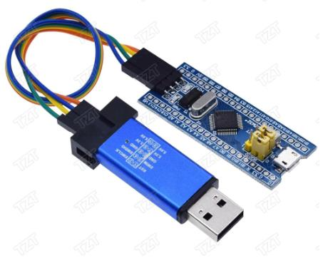

# SiGameIRL v0.2
Устройство для проведения "Своей игры" (SIGame) через "SImulator".

Автор программы для ПК Владимир Хиль: https://vladimirkhil.com/si

Это версия 0.2

Тестирование платы:
* https://www.youtube.com/watch?v=EU762Oh5ceg

Игровое тестирование подъедет как только мы проведем игру... 

# Что вам потребуется

## Ведущий

* STM32F103C8T6 "Blue pill" (не запаянная) + программатор STLink v2 (желательно)
<dl></dl>

* Arduino nano (не запаянная)
<dl></dl>

* Переключатель (опционально; 2 шт, либо 1 шт двухканальный, для разрыва цепи UART для программирования Arduino)

* Max7219 7-сегментный дисплей
<dl></dl>

* WS2812B светодиодная лента (60 светодиодов/м, 14 светодиодов с длинной 23.4см, можно также использовать и другую плотность светодиодов, общей длинной 23.4см, количество должно быть четным)
<dl></dl>

* Кнопки 12х12мм с крышкой (13 шт)
<dl></dl>

* Фоторезистор
<dl></dl>

* Резистор 10000 Ом (11 шт)

* JST 3 pin (8 шт)
<dl></dl>

* Макетная плата (для пайки соединителей игроков) 

* Болты м3 (4 шт 6-12мм)

* Конденсатор электролитический (опционально, для впайки по питанию между +5в и землей)

## Игрок (Умножаем на количество игроков, x8 обычно, но использовать можно и меньше)

* Кнопка 12x12мм (такие же как у судьи, но без крышек)
<dl></dl>

* Резистор 300-1000 Ом

* Светодиоды (3 шт, можно и 1-2шт; цвет не важен; запаиваются параллельно)

* BLS 3 pin

* PLS 3 pin

# Собранный вид

* Собранный вариант (без питания от аккумуляторов)
<dl></dl>
<dl></dl>
<dl></dl>

* Кнопка игрока
<dl></dl>
<dl></dl>

* Внутри
<dl></dl>
<dl></dl>
<dl></dl>
